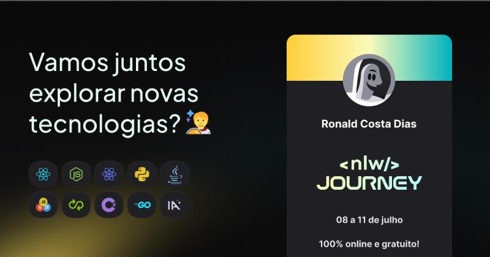

# 📜 NLW Journey

In this week occurred the NLW, a Rocketseat programming event. This event called NLW ( Next Level Week ) have a lot of trails for example: Node, React, React Native, C#, DevOps, etc and all this trails developed de plann.er.

I participated in the trails of Node, React and React Native and I learned a lot of things and improved my knowledge, you can check my projects cloning this repository where there are folders 'backend' (Node.js) , 'frontend' (React), 'mobile' (React Native) and 'server_mobile' (React Native) and execute them in your devices.

## 🚀 Technology's used

- 🟢 Node.js
- 🔵 React
- 🟣 React Native